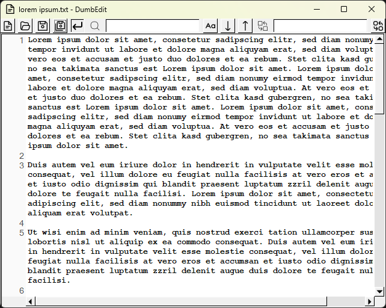

[](https://github.com/falk-werner/dumb-edit/actions/workflows/build.yaml)

# Dumb Edit

Minimalstic text editor written in Rust.



## Create Installer

Build release:

```bash
cargo build -r
```

Set the icon:

```bash
rcedit-x64.exe target/release/dumb-edit.exe --set-icon src/img/32x32.ico
```

Create the msi installer package:

```bash
dotnet build
```


## References

- [fltk rs](https://docs.rs/fltk/latest/fltk/index.html)
- [flaticon](https://www.flaticon.com/)
- [Wix Toolset](https://www.firegiant.com/wixtoolset/)
- [rcedit](https://github.com/electron/rcedit)
