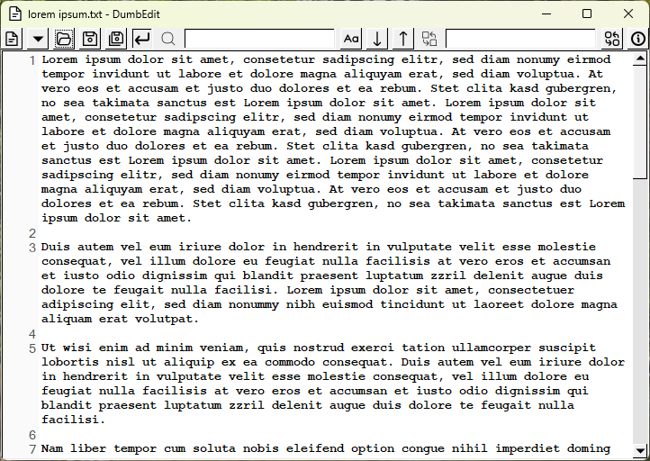

[](https://github.com/falk-werner/dumb-edit/actions/workflows/build.yaml)

# Dumb Edit

Minimalstic text editor written in Rust.



## Build Workflow

### Build

```bash
cargo build
```

### Unit Tests

```bash
cargo test
```

### Static Code Analysis

```bash
cargo clippy
```

### Create Installer

```bash
./build_installer.sh
```

## Development Dependencies

- [cargo](https://doc.rust-lang.org/cargo/)
- [Wix Toolset](https://www.firegiant.com/wixtoolset/)  
  requires dotnet
- [rcedit](https://github.com/electron/rcedit)

## References

- [fltk rs](https://docs.rs/fltk/latest/fltk/index.html)
- [flaticon](https://www.flaticon.com/)
- [Wix Toolset](https://www.firegiant.com/wixtoolset/)
- [rcedit](https://github.com/electron/rcedit)
